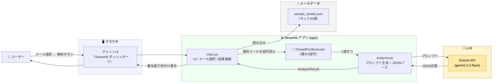

# st03-context-agent

サブテーマ3「文脈・意図の理解」プロトタイプ。  
日本語ビジネスメールの **表面と裏のズレ**（丁寧な怒り／諦めの短文／感情の変化）を Gemini で解析し、優先度・感情スコアを Streamlit ダッシュボードで可視化します。

## アーキテクチャ

LangGraph エージェントや MCPサーバーは使わず、**Streamlit が UI とアプリロジックを兼ね、その先に Gemini API を 1段だけ呼ぶ** 「LLM完結型」のシンプルな構成です。
選択された複数メールは `ThreadPoolExecutor`（最大4並列）で同時に Gemini に投げ、JSONで返ってきた評価結果を優先度順に色付けして表示します。



## 構成

```
st03-context-agent/
├─ app/
│  ├─ analyzer.py     # Gemini API 呼び出し + JSONパース
│  └─ main.py         # Streamlit UI
├─ data/
│  └─ sample_emails.json   # モックメール 20通（シナリオ①②③を含む）
├─ requirements.txt
├─ README.md
└─ local_debug/            # 検証用資料・レポート
```

### 評価軸（Geminiに出力させるJSON）

| キー | 内容 |
| --- | --- |
| `urgency` | 緊急度 (0.0〜1.0) |
| `dissatisfaction` | 不満度（裏にある不満・諦めも含む） |
| `toneWorsening` | トーン悪化度（表面と本心のズレも含む） |
| `priority` | `最優先` / `高` / `中` / `低` |
| `summary` | 真意の読み解き要約（日本語） |

---

## セットアップ

### 1. 仮想環境を作成

```bash
python3 -m venv .venv
source .venv/bin/activate
pip install -r requirements.txt
```

### 2. Gemini API キーを設定

```bash
export GEMINI_API_KEY="your_gemini_api_key"
# 任意：モデルの上書き
export GEMINI_MODEL="gemini-2.5-flash"
```

> 開発用の API キーは `local_debug/secrets/gemini.md` を参照（gitignore済み）。

### 3. 起動

```bash
streamlit run app/main.py
```

ブラウザで `http://localhost:8501` を開きます。

---

## 使い方

1. サイドバーの一覧から、解析したいメールを複数選択。
2. **🚀 選択したメールを解析する** を押す。
3. 優先度で色付けされた一覧と、メール毎の詳細（緊急度・不満度・トーン悪化・要約）が表示されます。

優先度の色：

| 優先度 | 色 |
| --- | --- |
| 🔴 最優先 | 赤 |
| 🟠 高 | オレンジ |
| 🟡 中 | 黄 |
| 🟢 低 | 緑 |

---

## サンプルメールの内訳

`data/sample_emails.json` には、検証プランのシナリオに沿って20通を収録：

- **① 丁寧な怒り**（例: `mail-001`「前回も同様の説明を頂いており…」）
- **② 諦めの短文**（例: `mail-002`「もう大丈夫です。」、`mail-020`「もう結構です」）
- **③ 感情の変化スレッド**（`thread_id: T-E1` / `T-L1` の3通ずつ）
- 通常のビジネスメール（依頼／障害連絡／資料送付など）

---

## 既知の制限・今後

- メール取得はモックJSON。将来的に Microsoft Graph API への置き換えを想定。
- 解析は1通ずつ独立。スレッド全体を見る案B（LangGraph 等）への発展を予定。
- API キーは環境変数のみ対応（Streamlit Secrets連携は未実装）。
