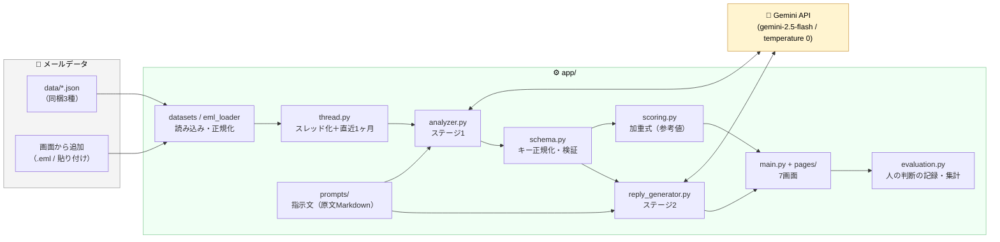

# st03-context-agent

サブテーマ3「文脈・意図の理解」プロトタイプ。
日本語ビジネスメールの **表面と裏のズレ**（丁寧な怒り／諦めの短文／感情の変化）を Gemini で読み解き、
**そのパラメータを使って返信案を作らせ、どちらの返し方が良いかを人が比較する** ところまでを1つのStreamlitアプリで回します。

## 📬 メールクライアントとして使う（受信トレイ）

起動後、サイドバー先頭の **📬 受信トレイ** を開くと、研究で有効性を確認したプロンプトを搭載したメールクライアントとして使えます。

- **左**：受信メール一覧。AIが判定した優先度（🔴最優先／🟠高／🟡中／🔵低）で色分け・並べ替え。差出人は署名（会社・部署・役職）で表示
- **右**：選んだメールの本文と、AIの読み取り結果（優先度・要約・7指標・判定の論拠）
- **下**：返信案を3つの書き方で同時に生成して横に並べる（同じメール・同じAI・同じ設定で、指示文だけが違う）

| 画面の表示 | 指示文 | 向く場面（最終報告（３）の結論） |
| --- | --- | --- |
| 簡潔に伝える | `reply_r1_plain_v2`（平井さん0909改訂版・感情言語化なし） | 通常の確認・進捗連絡 |
| 配慮を添える | `reply_r1_verbalize_v2`（平井さん0909改訂版・感情言語化あり） | お詫び・念のための確認・寄り添い |
| 配慮＋論点整理 | `reply_r2_empathy_organized`（赤木さん案②-C） | 行き違い・未解決事項がある場面（検証②で最高評価） |

- 使うAIは画面上部で **Gemini / OpenAI / Claude** から選べます（キーが設定されているもの）
- 個人のメールアカウント（Gmail / Outlook.com）から **IMAP・読み取り専用** で取り込めます（📥 メールデータ →「個人のメールアカウントから取り込む」）
- **送信機能はありません**。返信案は人が確認・選択し、コピーして各自のメールソフトから送ります

## 研究ステージとアプリの対応

| 研究ステージ | やること | 画面 |
| --- | --- | --- |
| **ステージ1** 感情パラメータ化 | 受信メール（スレッド）を読み解き、7指標＋総合優先度＋判定の論拠を数値化・言語化する | 🔍 ステージ1_感情分析 |
| ステージ1（改良） | 分析プロンプトA/Bを当てて、スコアとラベルの差を見る | 🔬 研究_ステージ1プロンプト比較 |
| **ステージ2** 返信案生成 | ①パラメータ＋②メール本文（固定）に、③④返信の指示文（可変）を当てて返信案A/Bを作る | ✍️ ステージ2_返信案生成 |
| ステージ2（評価） | A/Bを読み比べ、どちらが良いか＋理由を記録する（ペア比較） | 🔬 研究_返信案ペア比較 |
| 答え合わせ | 人の感覚値とAIスコアのズレ／ペア比較の集計を見る | 🔬 研究_答え合わせ |

> **返信文を書くのは人ではなくLLM。** 人がやるのは①②の材料をそろえて、③④の指示文を書き分けること。
> 出てきた差＝指示文の差になります（案①感情言語化／案②共感の出し方／案③背景仮説は、返信生成プリセットとして同梱）。

## アーキテクチャ

LangGraph や MCPサーバーは使わず、**Streamlit が UI とアプリロジックを兼ね、その先に Gemini API を呼ぶ** シンプルな構成です。
指示文（プロンプト）は Python に埋め込まず `app/prompts/*.md` に原文のまま置き、画面のプルダウンで差し替えます。



## 構成

```
st03-context-agent/
├─ app/
│  ├─ main.py                 # ホーム（使い方・データとプロンプトの一覧）
│  ├─ pages/                  # 0_受信トレイ ／ 1_メールデータ・2_感情分析・4_返信案生成 ／ 91〜94_研究用（8画面）
│  ├─ analyzer.py             # ステージ1：解析実行（プロンプトID指定・再試行）
│  ├─ reply_generator.py      # ステージ2：返信案生成（A/Bは同一設定）
│  ├─ schema.py               # JSON抽出・日本語併記キーの正規化・AnalysisResult
│  ├─ thread.py               # スレッド化・直近1ヶ月・LLM入力の整形
│  ├─ scoring.py              # 加重式（参考値）・ラベル閾値・表示色
│  ├─ evaluation.py           # 人の判断の記録・集計（MAE／勝率）
│  ├─ datasets.py             # 同梱データセットの読み込み・正規化
│  ├─ eml_loader.py           # .eml の読み込み（文字コード復元つき）
│  ├─ llm.py                  # LLM呼び出しの共通部（Gemini / OpenAI / Claude）
│  ├─ mail_fetch.py           # IMAP（読み取り専用）でのメール取り込み
│  ├─ ui_common.py            # 画面共通部品（セッション・ガード・表）
│  └─ prompts/                # 指示文（Markdown・原文のまま）
├─ data/                      # 同梱メールデータ（JSON）
├─ scripts/convert_sources.py # xlsx / .eml → JSON 変換（開発用）
├─ .streamlit/config.toml     # ライトテーマ固定（画面収録用）。secrets.toml は gitignore
├─ tests/                     # pytest（158件・API不要）
├─ requirements.txt / requirements-dev.txt
└─ local_debug/               # 検証用資料・レポート
```

### 同梱メールデータ

| データセット | 通数 | 内容 |
| --- | --- | --- |
| ① 赤木さんデモメール | 15 | 関係良好10通／関係険悪5通（吉田さん・廣瀬さん検証と同じもの） |
| ② 混在感情メール | 50 | 丁寧だが婉曲な断り等（平井さんのIBMツールと同一の `.eml`） |
| ③ モックメール v2 | 23 | TO/CC・署名の役職つき。**役職あり／なしの対照ペア**と承認要求メールを含む |
| （旧）モックメール | 20 | 中間発表2時点のデータ（互換確認用） |

`.eml` の追加・本文の貼り付けは「📥 メールデータ」画面から誰でもできます（セッション内。JSONでダウンロードして共有）。

### 評価軸（ステージ1でGeminiに出力させるJSON）

吉田さん最新指示文は「英単語＋（日本語）」のキーで返します。アプリ側は英語キーに正規化して扱います。

| キー | 内容 |
| --- | --- |
| `urgency` / `demand` | 緊急度 / 要求度 |
| `dissatisfaction` / `accumulatedDissatisfaction` | 不満度 / 蓄積された不満度 |
| `toneWorsening` / `delayScore` / `troubleRisk` | トーン悪化 / 遅延 / トラブルリスク |
| `priorityScore` / `priorityLabel` | 総合優先度（0.0〜1.0）／`最優先` `高` `中` `低` |
| `summary` | スレッド全体の1行要約 |
| `analysisReasoning` | 判定の論拠（緊急度／不満・トーン／遅延・リスク） |

優先度の色： 🔴 最優先（0.75以上）／🟠 高（0.50以上）／🟡 中（0.30以上）／🔵 低（0.30未満）

> **総合優先度は「AIの出力値」を採用値**とし、吉田さんレポートの加重式は**参考値**として併記します。
> 指示文には「相談メールは一律0.5以上」等のルールがあり、加重式で上書きするとそのルールが消えるためです。
> 両者の差は「どこで補正ルールが効いたか」を示す検証材料になります。

---

## セットアップ

### 1. 仮想環境を作成

```bash
python3 -m venv .venv
source .venv/bin/activate
pip install -r requirements.txt
```

### 2. API キーを設定（Gemini / OpenAI / Claude のどれか1つ以上）

環境変数、またはリポジトリ直下の `.streamlit/secrets.toml`（gitignore済み・TOML形式）で設定します。

```toml
# .streamlit/secrets.toml（値は必ず "" で囲む）
GEMINI_API_KEY = "your_gemini_api_key"
OPENAI_API_KEY = "your_openai_api_key"
ANTHROPIC_API_KEY = "your_anthropic_api_key"

# 任意：モデルの上書き
# GEMINI_MODEL = "gemini-2.5-flash"
# OPENAI_MODEL = "gpt-4o-mini"
# ANTHROPIC_MODEL = "claude-opus-5"   # 既定。例: "claude-sonnet-5"
```

環境変数なら `export GEMINI_API_KEY="..."` のように同じ名前で設定します（`LLM_PROVIDER=gemini|openai|anthropic` で既定のAIを固定可）。
複数設定すると、受信トレイ上部の「使うAI」や各画面のサイドバー「モデル設定」で切り替えられます。

> Claude は Opus 5 以降 `temperature` を受け付けないため送っていません（出力の揺れは他AIより大きくなり得ます）。
> 安全性判定で応答が拒否された場合にサーバー側で別モデルに切り替える `fallbacks`（beta）を有効にしています。

> 開発用の API キーは `local_debug/secrets/gemini.md` を参照（gitignore済み）。
> Streamlit Cloud では App settings → Secrets に `GEMINI_API_KEY = "..."` の形で設定します（環境変数としても読めます）。

### 3. 起動

```bash
streamlit run app/main.py   # 必ずリポジトリ直下で実行（.streamlit/ の設定を読むため）
```

ブラウザで `http://localhost:8501` を開きます。

---

## 研究の検証フローの使い方（上のページから順に）

1. **📥 メールデータ** … 使うサンプルを選ぶ（そのままでもOK）。`.eml` の追加や本文の貼り付けもここ。
2. **🔍 ステージ1_感情分析** … スレッドを選んで解析 → 7指標・優先度・論拠が出ます。
3. **✍️ ステージ2_返信案生成** … ステージ1の結果が自動で流し込まれます。返信の指示文A/Bを選んで生成。
4. **🔬 研究_返信案ペア比較** … A/B（既定はブラインド）を読み比べ、勝ち・5軸スコア・理由を記録 → CSVでダウンロード。
5. **🔬 研究_答え合わせ** … 人の感覚値とAIスコアのMAE・ラベル一致率、ペア比較の勝率を集計。
6. **🔬 研究_プロンプト管理** … 指示文を読む／書き換えて自分用に保存（組み込みは上書きされません）。

### APIコストと出力の揺れについて

- 生成AIの回答は同じ入力でも毎回少し変わります（0.05程度の差はよく起きます）。大事な判定は2〜3回実行して見比べてください。
- 逆に、0.05程度の差を「プロンプト改良の効果」と結論づけないでください。
- 1回の実行は **20件まで**。同じ条件（メール×指示文×モデル×temperature）の再実行はキャッシュを使い、APIを呼びません。
  意図的に揺れを見たいときは「🔁 同じ条件でもう1回実行」を使います（履歴が並びます）。

---

## テスト

```bash
source .venv/bin/activate
pip install -r requirements-dev.txt
python -m pytest tests -q
```

LLM呼び出しはすべてフェイククライアントに差し替えているため、**APIキー無し・課金なし**で全件実行できます。
画面については Streamlit の `AppTest` で、描画と「解析／生成／記録」ボタンの動作まで検証しています。

## デプロイ（Streamlit Community Cloud）

- 公開URL: https://st03-context-agent.streamlit.app/
- **`main` ブランチに入った内容が自動で反映されます**（作業ブランチ → PR → main にマージ）。反映されないときは App settings の右上メニューから **Reboot app**。
- APIキーは App settings → **Secrets**（TOML形式）。詳しい手順は `local_debug/003_ASK_プロンプト改善/005_CLAUDE_デプロイと諸々ガイド.md` を参照。
- 画面の切り替えは**左サイドバーのページ一覧**、またはホーム画面のリンクボタンから。

## 既知の制限・今後

- メール取得はモックJSON・`.eml` 取り込み・個人アカウントのIMAP（読み取り専用）。社内Outlookとの連携（Microsoft Graph API）はIT承認が必要なため対象外。
- 追加したメール・評価ログはブラウザのセッション内のみ（CSV/JSONでダウンロードして共有）。全員共有が必要になれば Google Sheets 1枚での永続化を検討。
- 「⚙️ プロンプト管理」で保存した指示文は `app/prompts/user/` に置かれます。ローカルでは残りますが、**公開版では再起動で消えます**（Git管理外）。
- Streamlit Cloud への公開は、APIキーの利用上限の扱いが決まってから（`local_debug/002_handson作る/002_COWK_公開前のKey発行とその他考慮事項について.md`）。
- 「良い返信」の評価軸（意図伝達／関係性配慮／読みやすさ／過不足／そのまま送れるか）は暫定。ペア比較の理由を溜めて定義を作っていく前提。
